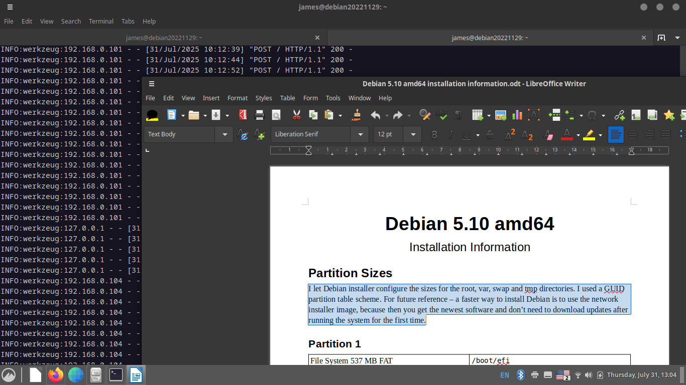

Install Piper Server Locally with Podman on Linux Open Desktop
==============================================================



This Dockerfile uses a script that runs a locally hosted speech server without
root permissions, ensuring that neighbouring computers cannot access your
speech server address on a home network. These instructions show you how
to launch it with a desktop file, but you could also install it using Docker
and configure it to start automatically when you turn on your computer.

You can follow these steps to experiment with piper-tts in a way that can be
completely removed or disabled using a Docker or Podman Desktop container
management tool.

This is not the only way to install a piper-tts server.

If you are using a Rhasspy home automation package, consult the [Rhasspy Voice
Assistant](https://rhasspy.readthedocs.io/en/latest/)and [Piper 1 GPL HTTP
API](https://github.com/OHF-Voice/piper1-gpl/blob/main/docs/API_HTTP.md)
documentation for recommendations on setting up a speech server that works
over a home network.

## 1. Install Podman or Docker

### Podman

- Use podman and install piper-tts as a local user with the minimum permission
  to restrict the piper-server to the host computer.
- Update package lists and install a container management tool. Debian, Red
  Hat and related derivatives include `podman` in their normal repositories.
  
If you are using a Debian derivative, use `apt-get`.

```bash
sudo apt-get update
sudo apt-get upgrade
sudo apt-get install podman
```
On current releases of Red Hat derivatives, `podman` tools are installed
by default.

See also [What is Podman?](https://docs.podman.io/en/latest/)

### Docker

The makers of Docker describe specific installation procedures for [supported
platforms](https://docs.docker.com/engine/install/) and suggestions for
derivatives of the suggested platforms.

---

## 2. Install Piper-TTS Server

Podman and Docker can use a short `Dockerfile` script to install and activate
the piper-tts server. You can use a different value for your default piper
model after listening to [Piper Voice
Samples](https://rhasspy.github.io/piper-samples/#en_GB-cori-medium). You
could also edit the release value for python, but python 3.11 was used as
the reference implementation for Debian 12.

```Dockerfile
FROM python:3.11-slim

# Create a non-root user and models directory
RUN groupadd --system piper && \
    useradd  --system --gid piper --home-dir /home/piper piper && \
    mkdir -p /models && \
    chown -R piper:piper /models

# Switch to piper, set up paths
USER piper
ENV HOME=/home/piper
ENV PATH="${HOME}/.local/bin:${PATH}"
WORKDIR /home/piper

# Upgrade pip inside the container's user environment
RUN python3 -m pip install --no-cache-dir --upgrade pip setuptools wheel

# Install Piper-TTS & Flask into ~/.local
RUN pip install --no-cache-dir piper-tts flask

# Download your model into /models
ARG MODEL=en_GB-cori-medium
RUN python3 -m piper.download_voices ${MODEL} --download-dir /models

EXPOSE 5000

CMD ["python3", "-m", "piper.http_server", \
     "--host", "0.0.0.0", \
     "--port", "5000", \
     "--data-dir", "/models", \
     "--model", "en_GB-cori-medium", \
     "--speaker", "0", \
     "--length_scale", "1", \
     "--noise_scale", "0.667", \
     "--noise_w", "0.8"]
```

Name the file `Dockerfile` (no extension) and install into a new blank
directory. In the terminal, use the `cd` command to change to that directory
before creating the `piper-tts` container.

**Note the "." at the end of the podman command below.**

```bash
cd '~/podman_piper-tts'
podman build -t piper-tts .
```

## 3. Use the server with a single voice model right away.

The `Dockerfile` installer recipe included a step to install an English voice
by default. The most recent version of `piper-server` also serves other voices
in a directory that you specify. This example uses the `flatpak` version of
the Pied speech manager models directory as a source of additional voice
models and configuration files. 

```bash
mkdir -p ~/.var/app/com.mikeasoft.pied/data/pied/models
cd ~/.var/app/com.mikeasoft.pied/data/pied/models
podman run -d \
  --name piper-tts \
  -p 5000:5000 \
  -v ~/.var/app/com.mikeasoft.pied/data/pied/models:/models:Z \
  piper-tts
```

## 4. Check the HTTP Server

You can check the available addresses for the piper-tts server service using
the log command.

```bash
podman logs -f piper-tts
```

The log output shows that the server is listening at `http://127.0.0.1:5000/`.
If the server is configured to do so, the server is also listening at the
computer's home IP address or a private address in the case of restricted
permission settings. If the server has permission, then the address allows
other machines on the same home network to access the service.

You can tell which voice models that a  piper client on your computer can
access by opening your browser and pasting <http://127.0.0.1:5000/voices>
into the address bar.

Also check whether you can read the available voices on other computers in
your home network by browsing to the second address shown in the server
terminal window.

If you use the extension on another computer on your home network, and the
server permissions allow it, you can access the home server by specifying
the specific address of the piper-server in the main dialog.

For example, using Avahi to define a local service name:

```
"(NETWORK_READ_TEXT_PY)" --url "http://piper.local:5000" --language (SELECTION_LANGUAGE_COUNTRY_CODE) "(TMP)"
```

## 5. Test the Server

Use `curl` or any HTTP client to synthesise speech:

```bash
curl -X POST -H 'Content-Type: application/json' \
     -d '{ "text": "Hello from Piper on this computer!" }' \
     -o output.wav http://127.0.0.1:5000
```

Play `output.wav` to confirm everything is working.

---

## 6. Download more Voice Models

If you install Pied using a `flatpak` command, then you can use it to add and
remove voice models in the directory shown above.

The [pied website](https://github.com/Elleo/pied) hosts the latest version/

Otherwise, you can modify the `Dockerfile` to add additional models to the
container.


## Desktop file

You can save a `desktop` file in a local applications settings file to make a
system menu item to start the server.

```ini
[Desktop Entry]
Type=Application
Name=Piper Speech Synthesis
Name[af]=Piper-spraaksintese
Name[bn]=পাইপার স্পিচ সিন্থেসিস
Name[de]=Piper-Sprachsynthese
Name[el]=Σύνθεση ομιλίας Piper
Name[en]=Piper Speech Synthesis
Name[es]=Síntesis de voz Piper
Name[fa]=سنتز گفتار پایپر
Name[fi]=Piper-puheensynteesi
Name[fr]=Synthèse vocale Piper
Name[gu]=પાઇપર ભાષણ સંશ્લેષણ
Name[ha]=Haɗa Magana ta Piper
Name[hu]=Piper beszédszintézis
Name[it]=Sintesi vocale Piper
Name[jv]=Sintesis Pidato Piper
Name[ko]=파이퍼 음성 합성
Name[ne]=पाइपर वाक संश्लेषण
Name[nl]=Piper-spraaksynthese
Name[pl]=Synteza mowy Piper
Name[ru]=Синтез речи Piper
Name[sw]=Uchanganuzi wa Hotuba wa Piper
Name[te]=పైపర్ స్పీచ్ సింథసిస్
Name[tn]=Piper go tlhama puo
Name[uk]=Синтез мовлення Piper
Name[vi]=Tổng hợp giọng nói Piper
Name[yo]=Ìṣàkóso Ohùn Piper
Name[zh-CN]=Piper语音合成
Comment=Start the Piper speech synthesis server
Comment[af]=Begin die Piper-spraaksintese-bediener
Comment[bn]=পাইপার স্পিচ সিন্থেসিস সার্ভার চালু করুন
Comment[de]=Piper-Sprachsynthese-Server starten
Comment[el]=Εκκίνηση του διακομιστή σύνθεσης ομιλίας Piper
Comment[en]=Start the Piper speech synthesis server
Comment[es]=Iniciar el servidor de síntesis de voz Piper
Comment[fa]=راه‌اندازی سرور سنتز گفتار پایپر
Comment[fi]=Käynnistä Piper-puheensynteesipalvelin
Comment[fr]=Démarrer le serveur de synthèse vocale Piper
Comment[gu]=પાઇપર ભાષણ સંશ્લેષણ સર્વર શરૂ કરો
Comment[ha]=Fara uwar garken Haɗa Magana ta Piper
Comment[hu]=Indítsa el a Piper beszédszintézis-kiszolgálót
Comment[it]=Avvia il server di sintesi vocale Piper
Comment[jv]=Miwiwiti server sintesis pidato Piper
Comment[ko]=파이퍼 음성 합성 서버 시작
Comment[ne]=पाइपर वाक संश्लेषण सर्भर सुरु गर्नुहोस्
Comment[nl]=Start de Piper-spraaksyntheseserver
Comment[pl]=Uruchom serwer syntezy mowy Piper
Comment[ru]=Запустить сервер синтеза речи Piper
Comment[sw]=Anzisha seva ya uchanganuzi wa hotuba wa Piper
Comment[te]=పైపర్ స్పీచ్ సింథసిస్ సర్వర్ ప్రారంభించండి
Comment[tn]=Simolola seva ya tlhama puo ya Piper
Comment[uk]=Запустити сервер синтезу мовлення Piper
Comment[vi]=Khởi động máy chủ tổng hợp giọng nói Piper
Comment[yo]=Bẹrẹ olupin ìṣàkóso ohùn Piper
Comment[zh-CN]=启动Piper语音合成服务器
Exec=gnome-terminal -- bash -c 'podman run --network host -v ~/.var/app/com.mikeasoft.pied/data/pied/models:/models:Z piper-tts'
Terminal=true
Icon=/usr/share/icons/gnome/256x256/apps/preferences-desktop-accessibility.png
Categories=Utility;Accessibility;
StartupNotify=true

```

Save it as `~/.local/share/applications/us.synesthesiam.piper-server.desktop`
and set the file to executable.

```bash
chmod +x ~/.local/share/applications/us.synesthesiam.piper-server.desktop
```

On a standard Linux desktop, the new item appears in your normal menu system once 
you log out and log in again.
