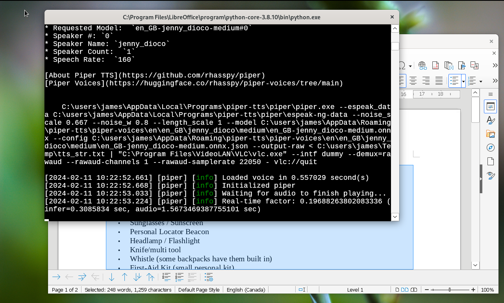

Install Piper Locally
=====================

**[Piper][1]** is a fast, local neural text to speech system.

On supported platforms Read Text Extension uses a local directory that follows
the format of the online Piper TTS directories. If the program doesn't start
when you type `piper.exe` or `piper-cli` in a command line window, then make
sure the program is in your system's `PATH` and that the machine type of your
computer matches the machine type of the program archive.

Linux
-----

Use your package manager to check if the [`python3-tkinter`][2] library or the
Zenity application is installed to enable the piper installation script dialogs.

To enable a visual user interface for playback, install [`vlc`][3].

Windows
-------

> The legacy console mode is deprecated and no longer being updated.
>
> -- *[Depreciated features in the Windows Client][4]*. Microsoft.
> Accessed January 3, 2024.

PowerShell supersedes the classic console. The safest way to run a [python][5]
script is by opening it in [Visual Studio Code][6] and clicking the "Run"
button. Visual Studio Code will show if it finds any issues.

> VBScript is deprecated. In future releases of Windows, VBScript will
> be available as a feature on demand before its removal from the
> operating system. 
> 
> -- *[Depreciated features in the Windows Client][7]*. Microsoft.
> Accessed January 3, 2024.

Starting with Read Text 0.8.74, the extension uses the LibreOffice and Apache
OpenOffice scripting systems if VBScript is not available. The default behavior
is to hide the setup menu if your Windows computer does not have VBScript. You
can enable alternative scripting methods like python. Use the LibreOffice
*Tools - Options - Advanced* tool and check *Enable Experimental Features*.

The [Rhasspy project][8] released a Windows pre-release of it's Piper TTS
software.

Starting with Read Text 0.8.74, the extension supports it as an experimental
feature in Windows. Install the app with the script, then enable it by going
to  *Tools - Options - Advanced* and selecting *Enable Experimental Features*.

To improve performance and enable a visual user interface for playback,
install the [VideoLAN VLC Media Player][9] desktop application.

(c) 2024, James Holgate.

[License][10]

  [1]: https://github.com/rhasspy/piper
  [2]: https://packages.debian.org/search?keywords=python3-tk
  [3]: https://packages.debian.org/search?keywords=vlc
  [4]: https://learn.microsoft.com/en-us/windows/whats-new/deprecated-features
  [5]: https://www.python.org/downloads/windows/
  [6]: https://code.visualstudio.com/
  [7]: https://learn.microsoft.com/en-us/windows/whats-new/deprecated-features
  [8]: https://github.com/rhasspy/piper
  [9]: https://www.videolan.org
  [10]: https://raw.githubusercontent.com/jimholgate/readtextextension/master/Read_Text/registration/LICENSE
