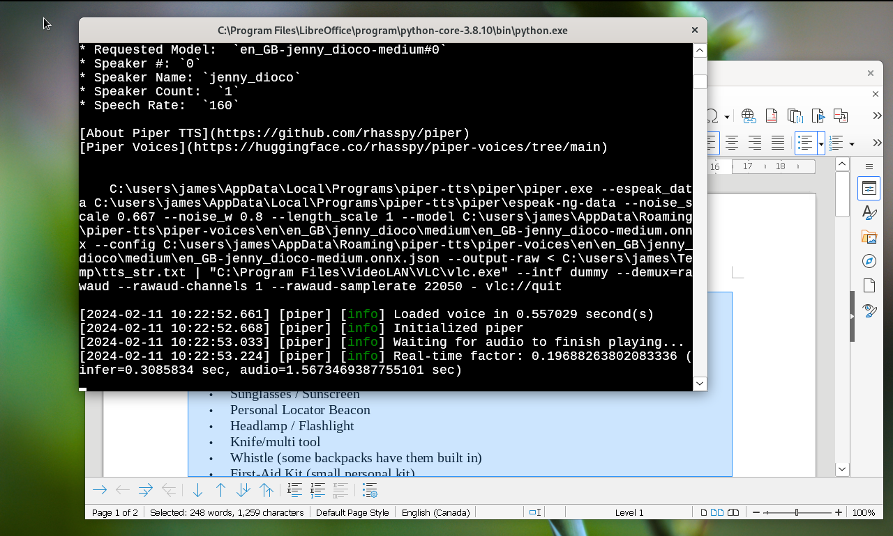

# What is Piper TTS?

The specific program shown in the image is Piper TTS, which is being run from a command line interface using Read Text Extension for LibreOffice. It's using the "en_GB-Jenny_dioco-medium" voice model to convert the text into speech.

## Summary

This is a text-to-speech program in action. It's a technology that converts written text into spoken words. Here's how it can help you read and study better:

1. **Auditory Learning**: Some people learn better when they hear information. This tool can read out the text, helping them to understand better and remember the material.
2. **Multitasking**: People can listen to the text while doing other tasks, making study time more efficient.
3. **Accessibility**: For people with dyslexia or other reading difficulties, this tool can be a big help because it lets them listen to the text instead of reading it.
4. **Writing and Editing**: If you are a writer or an editor, you can use this tool to check the style and flow of the text when read aloud. Listening to spoken text helps you catch mistakes like poor grammar and ineffective prose.

## Details

Piper works fast and doesn’t need to be connected to the internet to do its job. It uses speech models that it downloads from the internet. These files are like the instructions that tell Piper how to turn text into speech. Once Piper has these files, it can work offline and doesn’t share any information about what it’s reading or any personal details.

VLC is a media player. Piper sends the spoken words to VLC, which then plays it out loud. This is a neat setup because Piper processes the text in chunks, making it start up faster.

So, imagine you’re reading a book, but instead of reading it yourself, Piper reads it out loud for you, and VLC is the speaker that lets you hear it. And the best part? Piper gets ready faster because it reads the book paragraph by paragraph instead of processing the whole text in one go.

-----

1. <https://github.com/rhasspy/piper>
2. <https://huggingface.co/rhasspy/piper-voices/tree/main>
3. <https://www.videolan.org/vlc/>
